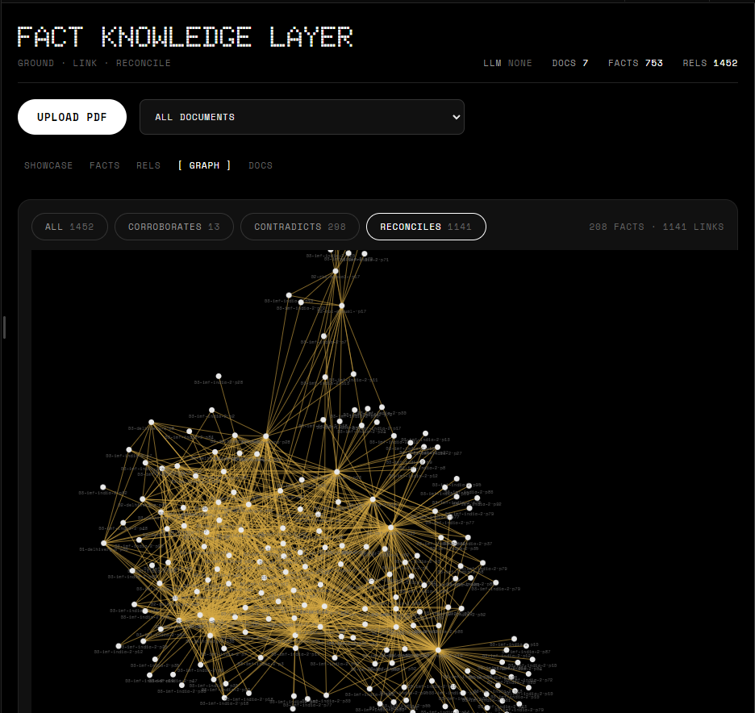

# Fact Knowledge Layer

This system reads PDF documents. It takes out facts. It links each fact to the
words in the source. It then compares facts from different documents. It tells
you when facts agree, when they fight, and when the fight is not real.


**Parts:** Python (FastAPI, PyMuPDF, SQLite, sentence-transformers) · React
(Vite) · An LLM is optional. The system works with no API key.

---

## 1. Set up and run

You need Python 3.12 or later, [uv](https://docs.astral.sh/uv/), and Node 18
or later.

### 1.1 Start the backend (port 8000)

```bash
cd backend
uv sync                                  # uv puts the packages in .venv
uv run uvicorn app.main:app --port 8000
```

The first start does three things:

1. It fills the database with seed knowledge. The seed has 40 facts and 14
   checked relationships. Each seed fact has a quote that a script verified
   against the real PDF pages.
2. It loads the local embedding model. The first download is about 90 MB.
   Later starts use the cache.
3. It starts the API on port 8000.

### 1.2 Start the frontend (port 5173)

```bash
cd frontend
npm install
npm run dev
```

Open `http://localhost:5173`. The UI has five tabs:

- **SHOWCASE** — the four cases that this assignment asks for. The system
  resolves them live from the database.
- **FACTS** — every fact with its claim, value, and source quote.
- **RELS** — relationships between facts. You can filter by kind.
- **GRAPH** — a force graph. Each node is a fact. Each link is a
  relationship. Click a node to see its quote and page.
- **DOCS** — the uploaded documents and their fact counts.

The UI uses the Nothing design language. It is black, monochrome, and
typographic.

### 1.3 Run with Docker (alternative)

Docker builds two images. One runs the backend. One serves the frontend.

```bash
docker compose up --build
```

- Backend: `http://localhost:8000`
- Frontend: `http://localhost:8080`
- The database, the uploads, and the model cache are volumes. They stay after
  you stop the containers.

Note: the backend image is large. The lock file pins CPU-only PyTorch, but the
first build still downloads many packages. This is normal.

### 1.4 Optional: use a real LLM

The system does not need an LLM. But you can turn one on:

```bash
export ANTHROPIC_API_KEY=sk-...     # or: OPENAI_API_KEY=sk-...
export LLM_PROVIDER=anthropic       # anthropic | openai
```

With a key, the system uses the LLM to extract facts and to classify
relationships. Without a key, it uses the seed knowledge and simple rules.
The UI always shows which mode is active. Do not put keys in the repository.
Use a `.env` file or shell variables.

### 1.5 API summary

| Method | Path                  | Action                                                   |
| ------ | --------------------- | -------------------------------------------------------- |
| POST   | `/api/upload`         | Send a PDF. The system extracts facts and compares them. |
| GET    | `/api/facts`          | List facts. Add `?doc_id=` to filter.                    |
| GET    | `/api/relationships`  | List relationships. Add `?kind=` to filter.              |
| GET    | `/api/showcase`       | Get the four demo cases and the failure log.             |
| GET    | `/api/documents`      | List documents.                                          |
| DELETE | `/api/documents/{id}` | Remove a document and its facts.                         |

The API docs are at `http://localhost:8000/docs`

## 3. Approach

### 3.1 Pipeline

```
PDF ─> INGEST ─> EXTRACT ─> VERIFY ─> COMPARE ─> STORE ─> API/UI
```

1. **Ingest.** PyMuPDF reads each page. The system merges short pages and
   splits long pages into chunks. Each chunk knows its document and page.
2. **Extract.** The LLM path asks for JSON. Each fact must carry a verbatim
   quote and a page number. The rule path takes sentences with numbers. Each
   sentence is its own fact, so the quote is exact.
3. **Verify.** This step is the core. The system takes each quote and looks
   for it in the real page text. It normalizes spaces and punctuation first.
   If it cannot find the quote, it rejects the fact and writes a failure
   record. No quote, no fact.
4. **Compare.** The system embeds all claims. Close pairs from different
   documents go to the classifier. The LLM path explains its choice and cites
   the quotes. The rule path compares numbers. Close numbers agree. Numbers
   that differ by a large factor are a units problem, not a fight.
5. **Store.** SQLite holds documents, chunks, facts, relationships, and
   failures. Each relationship ID is a hash of the two fact IDs. So the same
   pair always gets the same ID. Re-runs do not make duplicates.

### 3.2 The four cases

1. **Agreement with different words.** The earnings deck says "EBITDA ₹127 Cr".
   The annual report says "₹1,266.41 Mn". One crore is ten million. The values
   match.
2. **A real contradiction.** The IMF says CPI inflation for FY2025/26 will be
   2.8%. The RBI says 4.0% for the same year. Both are official. The system
   does not pick a winner. It shows both quotes and flags the conflict.
3. **A false contradiction.** The 2022 prospectus lists a director as active.
   The FY24 report says he resigned in 2023. Time explains this. Other
   examples: standalone loss vs consolidated loss (scope), and April-to-
   December inflation vs full-year inflation (coverage window).
4. **A failure we found.** The deck charts put their numbers far from their
   labels in the PDF text stream. A simple reader can take "1,429" as PTL
   revenue when it is PTL tonnage. The cross-document check against the annual
   report found this. The failure log keeps the details.

### 3.3 Decisions and trade-offs

- **Verify, then trust.** The LLM could be wrong. The quote check cannot.
  Cost: the system sometimes rejects a good fact with a bad quote. Benefit:
  no invented evidence gets in.
- **LLM optional.** Judges can run the demo with no key and no account. The
  cost is lower quality facts in rule mode. The UI labels the mode.
- **SQLite, not a vector database.** The facts are the product. Vectors only
  help to find candidate pairs. SQLite is simple to inspect and to ship.
- **Seed knowledge is checked data, not code.** The seed facts live in JSON.
  A build script proves each quote against the PDFs. The script fails loudly
  if a quote does not match. No filenames or schemas are hard-coded in the
  pipeline.

### 3.4 AI tools

An AI coding agent (Claude, through Codebuff/Freebuff) wrote this codebase.
It also read the six starter PDFs and proposed the seed facts, the seed
relationships, and the case notes. Then the build script verified every
seed quote against the real PDF pages. One quote failed the first check (a
curly apostrophe). The script caught it. We fixed the normalizer. This is the
system working as designed.

## 4. How the system deals with things

This section is for people who want the underlying ideas in short form.

- **A fact is not real without its source.** The pipeline can say anything.
  But a fact only enters the database if its quote exists in the PDF, on a
  page the system names. This rule has no exceptions.
- **The database knows what it does not know.** Rejected facts and failed
  comparisons go into a failure table. The UI shows them. A system that hides
  its errors is worse than a system that lists them.
- **IDs come from content, not from counters.** A relationship ID is a hash of
  its two fact IDs. Upload the same PDF twice and you get the same IDs. This
  makes the pipeline safe to re-run.
- **Checked knowledge beats pipeline output.** Seed relationships are marked
  as "seed". The pipeline never overwrites them. Machine output and human
  review can sit in the same table without fighting.
- **Big differences are usually units, not lies.** If two numbers differ by a
  factor of more than 3, the rule classifier says "units problem, needs a
  human". It does not shout "contradiction". Small differences get the honest
  label "likely different scope".
- **New PDFs only touch their own edges.** An upload extracts facts from the
  new file, then compares them against facts that already exist. The old
  knowledge does not get rebuilt. This makes the system incremental.
- **Two datasets, one schema.** The Delhivery documents and the India
  macroeconomy documents share nothing but the format. The same pipeline
  handles both. This is the test of generalization.

## 5. Limits and next steps

- **Charts and tables are the weak point.** Plain text extraction breaks
  chart layout. This caused the case 4 failure. Next step: use word
  coordinates (bounding boxes) to bind numbers to labels.
- **Rule-mode facts are noisy.** Without an LLM, the system takes every
  sentence with a number. Many are boilerplate. The confidence field says 30%.
  Next step: better sentence filters.
- **The rule classifier does not convert units.** It guesses that a big gap is
  a units problem. Next step: a unit layer (crore to million, tons to
  kilotons).
- **Upload blocks the request.** A 95-page PDF takes about 60 seconds in rule
  mode. Next step: a job queue with a status endpoint.
- **No numbers for quality.** There is no labeled test set, so there is no
  precision or recall score. Next step: a small golden set and a scoring
  script.
- **The LLM path is written but not yet exercised.** The code for Anthropic
  and OpenAI is in place and tested for shape, but no recorded run exists yet.
  Next step: one real run with a key, and sample output in this README.

## 6. Notes for developers

- `backend/seed/seed_source.json` — the raw curated facts (source of truth).
- `backend/scripts/build_seed.py` — verifies all quotes against the PDFs and
  writes `backend/seed/seed_knowledge.json`. Run it after you edit the source.
  It fails with a non-zero code if any quote does not match.
- `backend/scripts/ingest_starters.py` — runs the starter PDFs through the
  same code path as the upload endpoint. Useful for tests without the UI.
- `backend/seed/pdf_text/` — plain text dumps of the starter PDFs. These are
  working notes, not part of the product.
- Runtime data lives in `backend/data/`. Delete it to reset the knowledge
  base. The seed will rebuild on the next start.
- The starter PDFs live in `starter-datasets/`. Their READMEs list the
  original sources.
- Everything runs locally. The demo needs no paid service.
